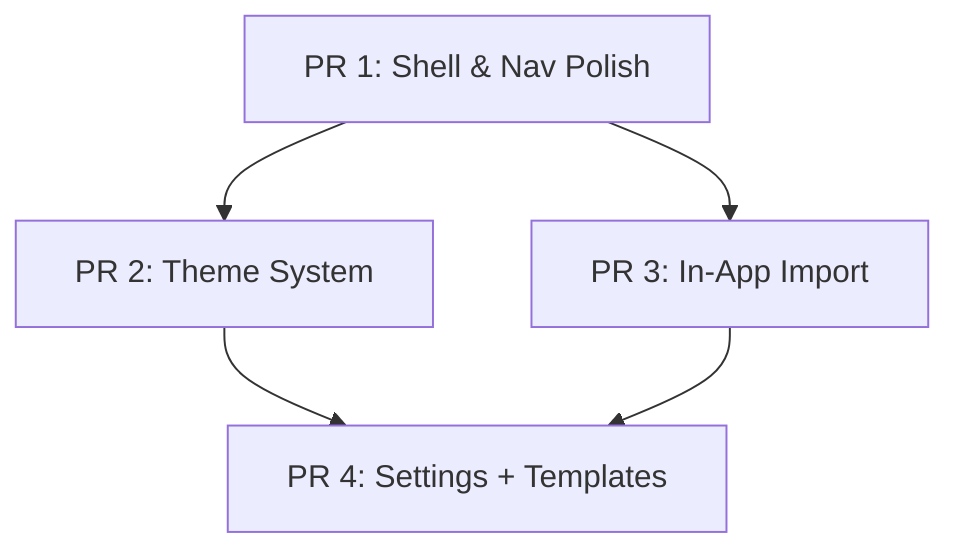

# Vocab App v0.2.0 — Implementation Plan

Nâng cấp shell UX, theme system, in-app import, settings expansion, và sample YAML templates. **4 PR**, mỗi PR shippable độc lập.

## Decisions (Confirmed)

- **Boot flow**: `loading → welcome → (tutor: locked → tutor) | (student: student)`. Lock quay về `welcome`. First-time setup cũng qua `welcome` trước.
- **Book title**: Editable từ UI (Content browser), lưu vào DB. YAML thêm optional `book_title` field + auto-derive fallback.
- **Theme**: 3 options — Light / Dark / System (real-time sync OS preference). Persist vào `app_settings`.
- **File format**: Hỗ trợ cả `.yaml` và `.yml`.
- **Settings**: Default exercise mode, session length, shuffle, font size, display density, app language (en/vi), definition priority, auto-lock timeout.

---

## PR 1 — Shell & Navigation Polish

**Branch**: `feat/v0.2.0-shell-polish`

### Traffic Light Fix

#### [MODIFY] [main.ts](file:///Users/mhdquan/Documents/vocab-app/electron/main.ts)
- Thêm `trafficLightPosition: { x: 16, y: 16 }` vào BrowserWindow options

#### [MODIFY] [Sidebar.tsx](file:///Users/mhdquan/Documents/vocab-app/src/ui/shell/Sidebar.tsx)
- Thêm prop `topInset` — pad top ~40px trên macOS (detect via `window.api.app.platform`)
- Thêm `-webkit-app-region: drag` zone ở phần trống trên brand

#### [MODIFY] [TutorLayout.tsx](file:///Users/mhdquan/Documents/vocab-app/src/ui/shell/TutorLayout.tsx)
- Truyền `topInset` cho Sidebar trên macOS

#### [MODIFY] [StudentLayout.tsx](file:///Users/mhdquan/Documents/vocab-app/src/ui/shell/StudentLayout.tsx)
- Padding-left cho header trên macOS

#### [MODIFY] [UnlockScreen.tsx](file:///Users/mhdquan/Documents/vocab-app/src/ui/screens/UnlockScreen.tsx)
- Top safe area padding cho macOS

---

### Welcome / Mode Selection Screen

#### [NEW] [WelcomeScreen.tsx](file:///Users/mhdquan/Documents/vocab-app/src/ui/screens/WelcomeScreen.tsx)
- Full-screen centered, logo + tagline
- Hai button lớn: **🎓 Tutor** (→ `locked`) và **📖 Student** (→ `student`)
- Drag region ở top, subtle hover/click animations

#### [MODIFY] [AppModeProvider.tsx](file:///Users/mhdquan/Documents/vocab-app/src/providers/AppModeProvider.tsx)
- `AppMode` thêm `'welcome'`: `"loading" | "welcome" | "locked" | "tutor" | "student"`
- Sau probe `hasPin` → chuyển sang `welcome` (không phải `locked`)
- Actions mới: `selectTutor()` (`welcome→locked`), `selectStudent()` (`welcome→student`)
- `lock()` chuyển về `welcome`

#### [MODIFY] [AppRoot.tsx](file:///Users/mhdquan/Documents/vocab-app/src/ui/shell/AppRoot.tsx)
- Thêm case `mode === "welcome"` → `<WelcomeScreen />`

---

### Book Title — Editable từ UI

#### [MODIFY] [vocab.schema.ts](file:///Users/mhdquan/Documents/vocab-app/src/application/import/vocab.schema.ts)
- Thêm optional `book_title: z.string().optional()` vào `vocabFileSchema`
- Backward compatible: nếu thiếu → auto-derive từ code (`destination-b1` → `Destination B1`)

#### [MODIFY] [vocab.import.ts](file:///Users/mhdquan/Documents/vocab-app/src/application/import/vocab.import.ts)
- Truyền `title` riêng biệt với `code` xuống `upsertBook`

#### [MODIFY] [vocab.parse.ts](file:///Users/mhdquan/Documents/vocab-app/src/application/import/vocab.parse.ts)
- Parse + pass `book_title` field

#### [NEW] IPC procedure `curriculum.updateBookTitle`
- Input: `{ id: number, title: string }`
- Update `books.title` trong DB

#### [MODIFY] [preload.ts](file:///Users/mhdquan/Documents/vocab-app/electron/preload.ts)
- Thêm `curriculum.updateBookTitle` API method

#### [MODIFY] [Content.tsx](file:///Users/mhdquan/Documents/vocab-app/src/ui/screens/tutor/Content.tsx)
- BooksPane: thêm inline edit cho book title (double-click hoặc edit icon)
- Hiện `book.title` làm tên chính, `book.code` nhỏ phía dưới (đã có layout này)

#### [MODIFY] Existing YAML files (5 files)
- Thêm `book_title: "Destination B1"` vào mỗi file

---

### Version Bump
- `package.json` → `"0.2.0-alpha.1"`
- `preload.ts` + `TutorLayout.tsx` → update version string

---

## PR 2 — Theme System

**Branch**: `feat/v0.2.0-theme-system`

### Theme Infrastructure

#### [MODIFY] [globals.css](file:///Users/mhdquan/Documents/vocab-app/src/styles/globals.css)
- `:root` → light palette; `.dark` → current dark palette

```css
:root {
  --color-fg: 20 25 35;
  --color-muted: 100 110 130;
  --color-muted-2: 160 168 180;
  --color-surface-0: 248 249 252;
  --color-surface-1: 255 255 255;
  --color-surface-2: 240 242 246;
  --color-border-subtle: 228 232 240;
  --color-border-strong: 200 206 218;
  --color-accent: 80 120 240;
  --color-accent-fg: 255 255 255;
  --color-success: 40 160 100;
  --color-warning: 210 150 40;
  --color-danger: 220 60 70;
}
.dark { /* existing dark values */ }
```

#### [NEW] [ThemeProvider.tsx](file:///Users/mhdquan/Documents/vocab-app/src/providers/ThemeProvider.tsx)
- Context: `{ theme: 'light'|'dark'|'system', resolvedTheme, setTheme }`
- Mount: read `app_settings.theme`, listen `prefers-color-scheme` for system mode
- Toggle `.dark` class on `<html>`
- Persist via `api.settings.set`

#### [MODIFY] [App.tsx](file:///Users/mhdquan/Documents/vocab-app/src/App.tsx) — wrap `<ThemeProvider>`
#### [MODIFY] [index.html](file:///Users/mhdquan/Documents/vocab-app/index.html) — remove hard-coded `class="dark"`
#### [MODIFY] [main.ts](file:///Users/mhdquan/Documents/vocab-app/electron/main.ts) — `backgroundColor` → CSS-managed

### Theme Toggle in Settings

#### [MODIFY] [Settings.tsx](file:///Users/mhdquan/Documents/vocab-app/src/ui/screens/tutor/Settings.tsx)
- `ThemeCard`: 3 visual options (Light/Dark/System), active highlight
- Grid refactor: `grid-cols-1 md:grid-cols-2 xl:grid-cols-3`

### Component Audit
- Verify all components use design tokens, no hard-coded colors
- Check: Button, Badge, Modal, Heatmap, PinInput, EmptyState, PageHeader, Avatar

---

## PR 3 — In-App Import Interface

**Branch**: `feat/v0.2.0-in-app-import`

### Backend

#### [NEW] [procedures/fileImport.ts](file:///Users/mhdquan/Documents/vocab-app/electron/ipc/procedures/fileImport.ts)
- `imports.uploadAndImport`: receive file content string → validate → copy to `content/books/<code>/` → run `ImportVocabUseCase` → return result
- `imports.openImportDialog`: Electron native file dialog (`.yaml`/`.yml`, multi-select) → import each

#### [MODIFY] [preload.ts](file:///Users/mhdquan/Documents/vocab-app/electron/preload.ts)
- `imports.uploadFile({ fileName, content })` + `imports.openImportDialog()`

#### [MODIFY] [main.ts](file:///Users/mhdquan/Documents/vocab-app/electron/main.ts)
- Pass `mainWindow` ref to IPC context for dialog parent

### Frontend

#### [NEW] [ImportModal.tsx](file:///Users/mhdquan/Documents/vocab-app/src/ui/components/ImportModal.tsx)
- Drag & drop zone (dashed border, upload icon, instruction)
- File validation (`.yaml`/`.yml` only, 5MB max)
- Progress indicator + result summary
- "Import another" / "Done" actions
- Uses existing `Modal.tsx` wrapper

#### [MODIFY] [Imports.tsx](file:///Users/mhdquan/Documents/vocab-app/src/ui/screens/tutor/Imports.tsx)
- "Import YAML" button in header → opens ImportModal
- "Browse files…" button → native dialog
- Refetch history after success

---

## PR 4 — Settings Expansion + Content Templates

**Branch**: `feat/v0.2.0-settings-templates`

### Settings Cards

#### [MODIFY] [Settings.tsx](file:///Users/mhdquan/Documents/vocab-app/src/ui/screens/tutor/Settings.tsx)
- 3-column layout (`xl:grid-cols-3`)

| Card | Settings |
|------|----------|
| **Change PIN** | (existing) |
| **Theme** | (from PR 2) |
| **Reward Sound** | (existing) |
| **Session Defaults** | Exercise count (5–30, default 15), mode (mixed/flashcard/MC), shuffle on/off |
| **Display** | Font size (S/M/L), compact mode toggle |
| **Language** | App language (en/vi — UI strings future), definition priority (EN-first/VI-first) |
| **Auto-lock** | Idle timeout (off/5/15/30/60 min), lock on window close toggle |
| **About** | App version, DB path, reset/clear data (with confirmation) |

Setting keys: `session_default_count`, `session_default_mode`, `session_shuffle`, `display_font_size`, `display_compact`, `locale`, `definition_priority`, `idle_timeout_minutes`, `lock_on_close`

> [!NOTE]
> Settings API đã generic (`settings.get/set`) — không cần thêm IPC procedures. Renderer-side settings hooks sẽ dùng TanStack Query với `queryKey: ["settings", "get", key]`.

---

### Sample YAML Templates

#### [NEW] [content/templates/vocab-template.yaml](file:///Users/mhdquan/Documents/vocab-app/content/templates/vocab-template.yaml)
- Đầy đủ tất cả fields, comments giải thích từng field
- 3–5 entries mẫu đa dạng (noun, verb, phrasal_verb, adjective, idiom)
- Cover: tất cả POS types, form kinds, collocation patterns, relation kinds

#### [NEW] [content/templates/grammar-template.yaml](file:///Users/mhdquan/Documents/vocab-app/content/templates/grammar-template.yaml)
- Grammar lesson template: book, unit, lesson (kind: grammar), topics array
- 2–3 topics mẫu với explanation, patterns, examples

#### [NEW] [content/templates/EXERCISE-REFERENCE.md](file:///Users/mhdquan/Documents/vocab-app/content/templates/EXERCISE-REFERENCE.md)
- Reference cho exercise types hiện tại + planned:
  - **flashcard**, **multiple_choice** (current)
  - **fill_blank**, **matching**, **ordering**, **translation**, **dictation** (planned)
- Mỗi type: mô tả, YAML data requirements, example snippet, grading logic

### Version Finalize
- `package.json` → `"0.2.0"`
- `README.md` — update status, roadmap, document new features

---

## Verification Plan

```bash
npm run typecheck && npm run lint && npm run test  # every PR
```

| PR | Manual Checks |
|----|---------------|
| 1 | Traffic lights clear of content • Welcome→Tutor→PIN→Dashboard flow • Welcome→Student flow • Lock→Welcome • Book title editable + persisted |
| 2 | Theme toggle L/D/S in Settings • Persist across restart • System follows OS • All screens correct in both themes |
| 3 | Drag & drop .yaml import • Native dialog import • File copied to content dir • Results in history • Reject non-yaml |
| 4 | Settings 3-col layout • All settings persist • Templates validate via dry-run • Reference doc complete |

## Dependency Graph


